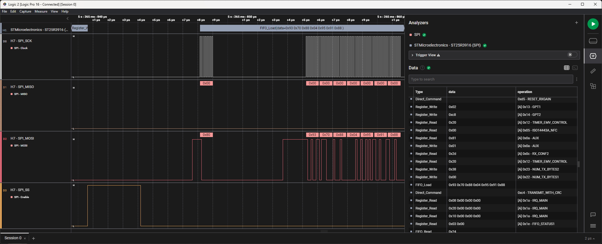

# STMicroelectronics - ST25R3916(B) (SPI)
High Level Analyzer for STMicroelectronics ST25R3916(B) NFC chip on SPI bus with Saleae Logic analyzer

## SPI settings
- Significant Bit: `MSB`
- Bits per Transfer: `8`
- Clock State: `CPOL = 0`
- Clock Phase: `CPHA = 1`
- Enable Line: `Active Low`

## References
- [https://www.st.com/en/nfc/st25r3916.html](https://www.st.com/en/nfc/st25r3916.html)
- [https://www.st.com/en/nfc/st25r3916b.html](https://www.st.com/en/nfc/st25r3916b.html)
- [https://www.saleae.com](https://www.saleae.com)

## Author
Benjamin DELPY `gentilkiwi`, you can contact me on Twitter ( @gentilkiwi ) or by mail ( benjamin [at] gentilkiwi.com )

## Licence
CC BY 4.0 licence - [https://creativecommons.org/licenses/by/4.0/](https://creativecommons.org/licenses/by/4.0/)